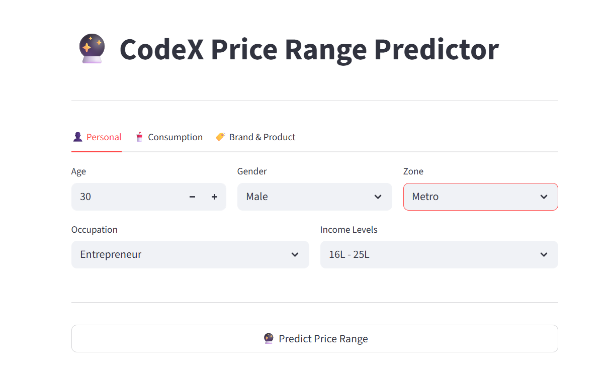
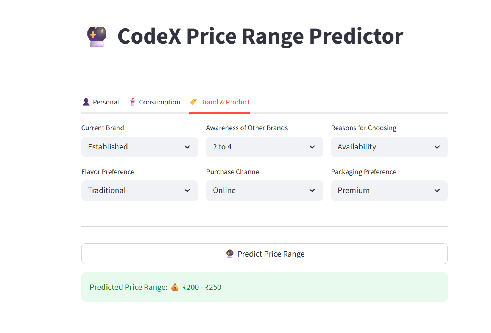

<<<<<<< HEAD
# 🔮 CodeX Price Range Predictor

## 📌 About the Project

CodeX is an energy drink brand looking to optimize its pricing strategy.
This app is built as part of the **AtliQ Technologies Data Science Internship**,
where survey data from **29,956 respondents** was used to train a machine learning
model that predicts the preferred price range of energy drink consumers.

---

## 🎯 Key Highlights

- 🧹 Cleaned and engineered features from raw survey data
- 🤖 Trained and compared **6 ML models**
- 🏆 Best model: **XGBoost** with **92.63% accuracy**
- 📊 Tracked all experiments using **MLFlow + DagsHub**
- 🌐 Deployed as an interactive **Streamlit** web app

---

## 📸 App Screenshots

| Home Screen | Prediction Result |
|-------------|------------------|
|  |  |

---

## 📊 Model Performance

| Model | Accuracy |
|-------|----------|
| Gaussian Naive Bayes | 58.03% |
| Logistic Regression | 84.54% |
| Support Vector Machine | 85.37% |
| Random Forest | 90.15% |
| LightGBM | 92.40% |
| **XGBoost** | **92.63% ✅** |

---

## 🛠️ Tech Stack

| Category | Tools |
|----------|-------|
| Language | Python |
| Data Processing | Pandas, NumPy |
| Machine Learning | Scikit-learn, XGBoost |
| Experiment Tracking | MLFlow, DagsHub |
| Web App | Streamlit |
| IDE | Jupyter Notebook, PyCharm |

---

## 🚀 How to Run

1. Clone the repository
```bash
   git clone https://github.com/your_username/codex-streamlit-app.git
```

2. Install dependencies
```bash
   pip install -r requirements.txt
```

3. Run the app
```bash
   streamlit run app.py
```

---

## 📁 Project Structure

```
codex-streamlit-app/
│
├── app.py                  # Streamlit app
├── xgboost_model.pkl       # Trained XGBoost model
├── encoder.pkl             # One-Hot encoder
├── requirements.txt        # Dependencies
├── README.md               # Project documentation
└── assets/
    ├── screenshot1.png     # App home screen
    └── screenshot2.png     # Prediction result
```

---

## 🔗 Connect with Me

[](https://www.linkedin.com/in/aditi-patil31/)
[](https://github.com/AditiPatil31)

---

## 🙏 Acknowledgements

- **AtliQ Technologies** for the internship opportunity
- **CodeBasics** for project guidance
=======
# codex-streamlit-app
>>>>>>> 4906d67a37323d018dec33e0a1210a94b659f163
